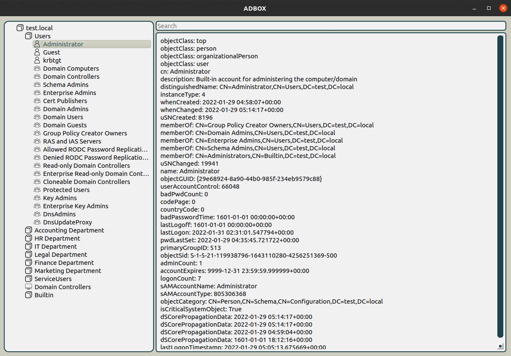

# Overview

The data collection module downloads information about users, computers and groups located in the domain and saves it to the sqlite3 database.


```bash
pc@pc:~$ python3 -m ADBox -m dump -s WIN-VBK1IMCTCKJ.test.local -u "TEST\Administrator" -p Qwerty12345 -db test.sqlite3
INFO:ADBox:BoxLdap.__init__: Bind successful
INFO:ADBox:BoxLdap.__init__: AD root - DC=test,DC=local
INFO:ADBox:BoxSql.__init__: Create new db test.sqlite3
INFO:ADBox:BoxLdap.GetUsers: Add 355 users
INFO:ADBox:BoxLdap.GetComputers: Add 349 computers
INFO:ADBox:BoxLdap.GetGroups: Found 81 groups
```

The data display module uses the information from the database to display it in view of the drop-down list.

```bash
python3 -m ADBox -m gui -db test.sqlite3
```


